# Web Application Document - Projeto Individual - Módulo 2 - Inteli

## League of Legends Guide

#### Rafael Santana Rodrigues

## Sumário

1. [Introdução](#c1)  
2. [Visão Geral da Aplicação Web](#c2)  
3. [Projeto Técnico da Aplicação Web](#c3)  
4. [Desenvolvimento da Aplicação Web](#c4)  
5. [Referências](#c5)  

<br>

## <a name="c1"></a>1. Introdução (Semana 01)

O **League of Legends Guide** é uma aplicação web educativa desenvolvida para ajudar novos jogadores a compreender os fundamentos do jogo League of Legends. O sistema oferece guias interativos sobre runas, feitiços, classes de campeões, lanes do mapa e mecânicas básicas.

A aplicação possui funcionalidades de autenticação que permitem aos usuários criar e salvar páginas de runas personalizadas, além de acessar conteúdo educativo estruturado sobre diferentes aspectos do jogo.

**Principais Funcionalidades:**
- Sistema de autenticação (login/registro)
- Construtor interativo de páginas de runas
- Guias educativos sobre mecânicas do jogo
- Interface responsiva e intuitiva
- Armazenamento de configurações personalizadas

---

## <a name="c2"></a>2. Visão Geral da Aplicação Web

### 2.1. Personas (Semana 01)

**Persona Principal: João, o Novo Invocador**
- **Idade:** 16-25 anos
- **Perfil:** Estudante/jovem profissional interessado em jogos competitivos
- **Experiência:** Iniciante em League of Legends
- **Objetivos:** Aprender fundamentos do jogo, criar builds de runas eficazes
- **Dores:** Informações espalhadas, interfaces complexas, falta de orientação estruturada

### 2.2. User Stories (Semana 01)

**US01 - Aprender sobre Runas**
Como um novo jogador, eu quero entender o sistema de runas para melhorar meu desempenho no jogo.

**US02 - Criar Páginas de Runas**
Como usuário autenticado, eu quero criar e salvar páginas de runas personalizadas para diferentes campeões.

**US03 - Consultar Guias**
Como iniciante, eu quero acessar guias sobre feitiços, classes e mecânicas para aprender progressivamente.

**US04 - Gerenciar Configurações**
Como usuário registrado, eu quero visualizar e gerenciar minhas páginas de runas salvas.

---

## <a name="c3"></a>3. Projeto da Aplicação Web

### 3.1. Modelagem do banco de dados (Semana 3)

#### Modelo Relacional do Banco de dados 

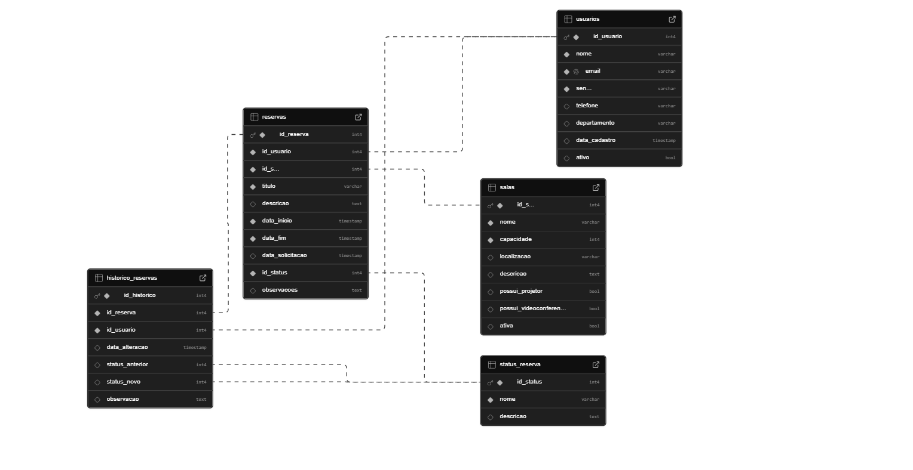

<hr>

#### Modelo Físico do Banco de Dados

```sql
-- Tabela de usuários para autenticação
CREATE TABLE usuarios_lol (
    id SERIAL PRIMARY KEY,
    username VARCHAR(50) NOT NULL UNIQUE,
    email VARCHAR(100) NOT NULL UNIQUE,
    password VARCHAR(255) NOT NULL,
    created_at TIMESTAMP DEFAULT CURRENT_TIMESTAMP
);

-- Tabela de páginas de runas salvas
CREATE TABLE rune_pages (
    id SERIAL PRIMARY KEY,
    user_id INTEGER REFERENCES usuarios_lol(id) ON DELETE CASCADE,
    name VARCHAR(50) NOT NULL,
    primary_tree VARCHAR(20) NOT NULL,
    primary_keystone VARCHAR(50) NOT NULL,
    primary_slot1 VARCHAR(50) NOT NULL,
    primary_slot2 VARCHAR(50) NOT NULL,
    primary_slot3 VARCHAR(50) NOT NULL,
    secondary_tree VARCHAR(20) NOT NULL,
    secondary_slot1 VARCHAR(50) NOT NULL,
    secondary_slot2 VARCHAR(50) NOT NULL,
    shard1 VARCHAR(20) NOT NULL,
    shard2 VARCHAR(20) NOT NULL,
    shard3 VARCHAR(20) NOT NULL,
    created_at TIMESTAMP DEFAULT CURRENT_TIMESTAMP,
    updated_at TIMESTAMP DEFAULT CURRENT_TIMESTAMP
);
```

### 3.1.1 BD e Models (Semana 5)

**Models Implementados:**

1. **User.js**
   - `findByUsername(username)` - Busca usuário por nome
   - `findByEmail(email)` - Busca usuário por email
   - `create(username, email, password)` - Cria novo usuário
   - `verifyPassword(user, password)` - Verifica senha com bcrypt

2. **RunePage.js**
   - `findAllByUser(userId)` - Lista páginas de runas do usuário
   - `create(runePage)` - Cria nova página de runas
   - `delete(id, userId)` - Remove página de runas

### 3.2. Arquitetura (Semana 5)

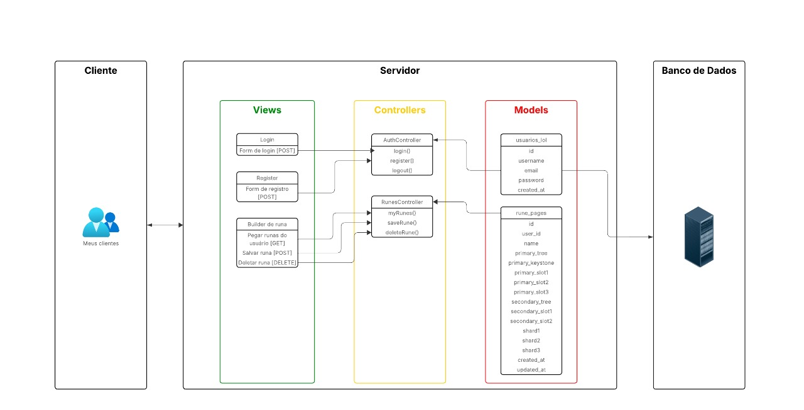

Segue imagem com a arquitetura do projeto.

A aplicação segue o padrão **MVC (Model-View-Controller)** com Express.js:

**Fluxo de Dados:**
1. **User Request** → Routes (`/routes/index.js`)
2. **Routes** → Controller (lógica de negócios)
3. **Controller** → Model (operações de dados)
4. **Model** → Database (PostgreSQL/Supabase)
5. **Database** → Model → Controller → View (EJS)
6. **View** → User Response (HTML renderizado)

**Componentes Principais:**

- **Controllers:**
  - `AuthController` - Autenticação e registro
  - `RunesController` - Sistema de runas e construtor
  - `HomeController` - Página inicial
  - `ChampionsController`, `SpellsController`, etc.

- **Views (EJS):**
  - `pages/` - Páginas principais
  - `auth/` - Login e registro
  - `partials/` - Componentes reutilizáveis

- **Models:**
  - Abstração da camada de dados
  - Validações e operações CRUD
  - Comunicação com PostgreSQL

- **Static Assets:**
  - `/public/stylesheet/` - CSS responsivo
  - `/public/scripts/` - JavaScript interativo
  - `/public/assets/` - Imagens e recursos

### 3.3. Wireframes (Semana 03)

Os wireframes foram desenvolvidos priorizando:
- **Navegação intuitiva** entre seções
- **Interface responsiva** para diferentes dispositivos
- **Feedback visual** para interações do usuário
- **Hierarquia clara** de informações

### 3.4. Guia de estilos (Semana 05)

**Paleta de Cores:**
- Primária: `#0F1B3C` (Azul escuro - background)
- Secundária: `#C8A964` (Dourado - acentos)
- Texto: `#CDBE91` (Bege claro)
- Cards: `#1e2d50` (Azul médio)

**Tipografia:**
- Font-family: Arial, sans-serif
- Hierarquia clara com tamanhos de 0.8rem a 3rem

**Componentes:**
- Cards com hover effects e transformações suaves
- Botões com gradientes e estados visuais
- Formulários com validação em tempo real

### 3.5. Protótipo de alta fidelidade (Semana 05)

O protótipo implementa:
- **Design system** consistente inspirado no universo de LoL
- **Animações** e micro-interações
- **Responsividade** completa
- **Acessibilidade** com contrast ratio adequado

### 3.6. WebAPI e endpoints (Semana 05)

**Rotas Principais:**

| Método | Endpoint | Descrição |
|--------|----------|-----------|
| GET | `/` | Página inicial |
| GET | `/runes` | Sistema de runas |
| GET | `/runes/builder` | Construtor de runas (auth) |
| GET | `/runes/my-runes` | Páginas salvas (auth) |
| POST | `/runes/save` | Salvar página de runas |
| DELETE | `/runes/:id` | Deletar página de runas |
| GET | `/login` | Formulário de login |
| POST | `/login` | Processar login |
| GET | `/register` | Formulário de registro |
| POST | `/register` | Processar registro |
| GET | `/logout` | Logout |

**Middleware:**
- `checkAuth` - Verificação de autenticação
- `express.session` - Gerenciamento de sessões
- `express.static` - Arquivos estáticos

### 3.7 Interface e Navegação (Semana 07)

**Frontend Desenvolvido:**

1. **Sistema de Navegação**
   - Menu responsivo com estados ativos
   - Breadcrumbs contextuais
   - Navegação por teclado (Alt + setas)

2. **Páginas Educativas**
   - Conteúdo interativo com JavaScript
   - Cards expansíveis e tooltips
   - Animações CSS suaves

3. **Sistema de Runas**
   - Construtor visual interativo
   - Preview em tempo real
   - Validação de seleções

4. **Autenticação**
   - Formulários com validação
   - Feedback visual de estados
   - Proteção de rotas sensíveis

#### **Capturas de Tela das Interfaces**

**1. Página Inicial** <br><br>
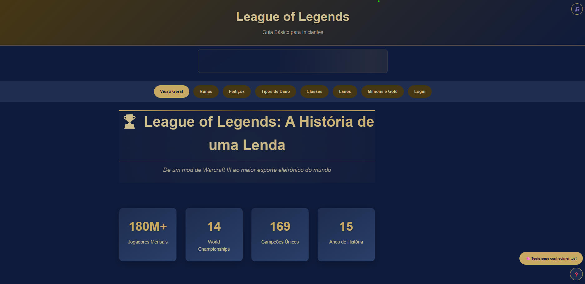

Página principal da aplicação apresentando a navegação principal e uma visão geral do League of Legends Guide. Interface clean com design inspirado no universo do jogo.

**2. Tela de Login** <br><br>


Formulário de autenticação com validação em tempo real, design consistente com a identidade visual da aplicação e feedback visual para estados de erro.

**3. Tela de Registro**<br><br>


Interface de cadastro de novos usuários com validação de campos, confirmação de senha e tratamento de erros para melhor experiência do usuário.

**4. Sistema de Runas - Visão Geral**<br><br>
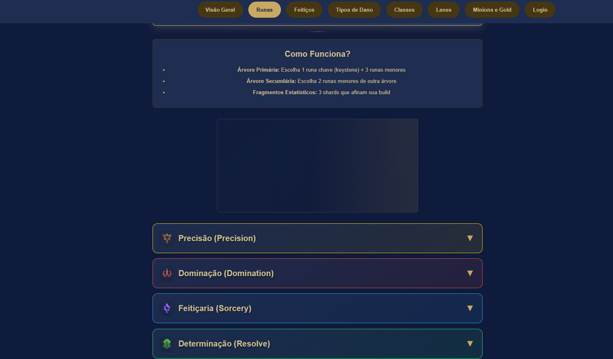

Página introdutória ao sistema de runas, explicando os conceitos fundamentais e fornecendo navegação para o construtor e páginas salvas.

**5. Construtor de Runas**<br><br>
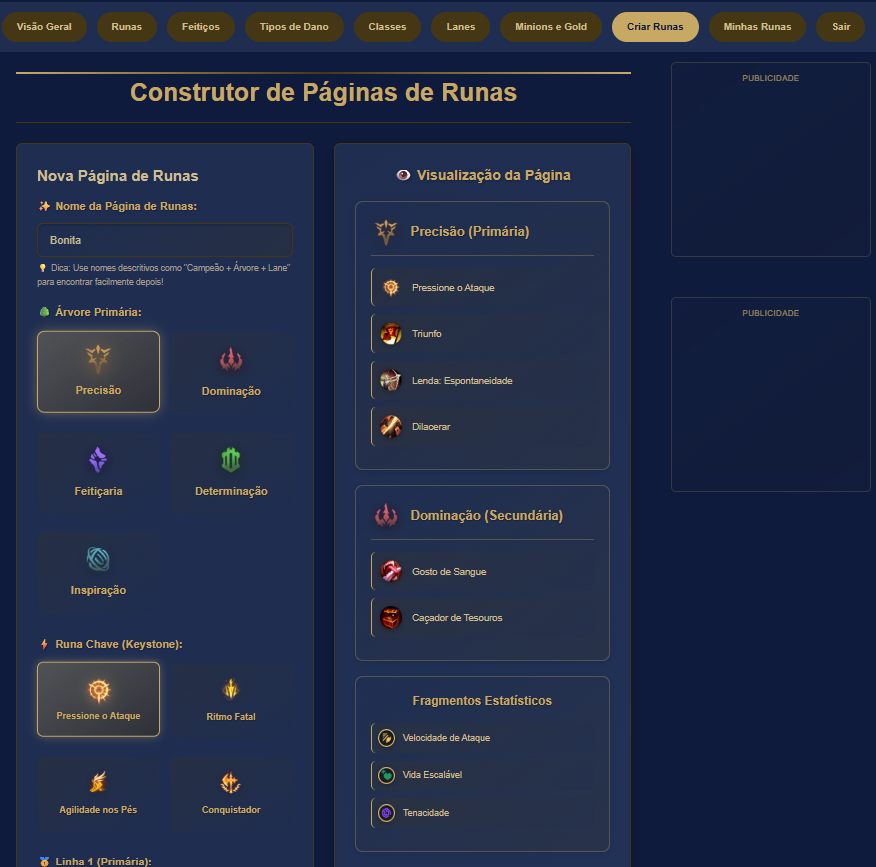

Interface interativa para criação de páginas de runas, com seleção visual de árvores primárias e secundárias, validação de regras e preview em tempo real.

**6. Minhas Runas**<br><br>
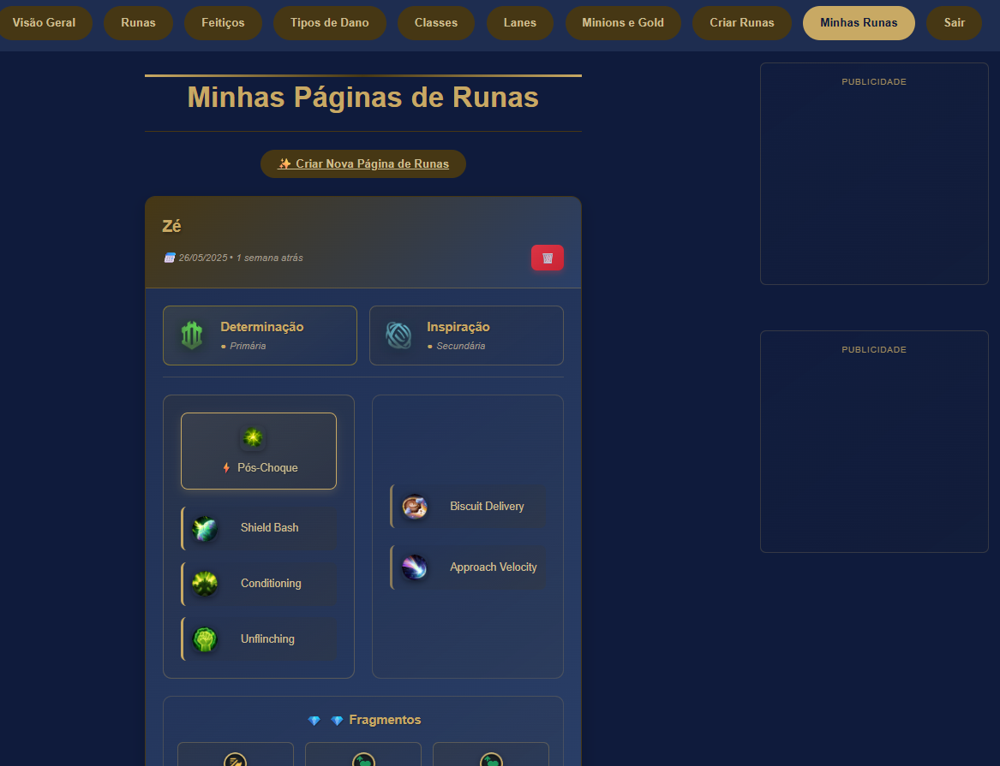

Página de gerenciamento das páginas de runas salvas pelo usuário, com visualização em cards, opções de edição e exclusão com confirmação.

**7. Guia de Campeões**<br><br>
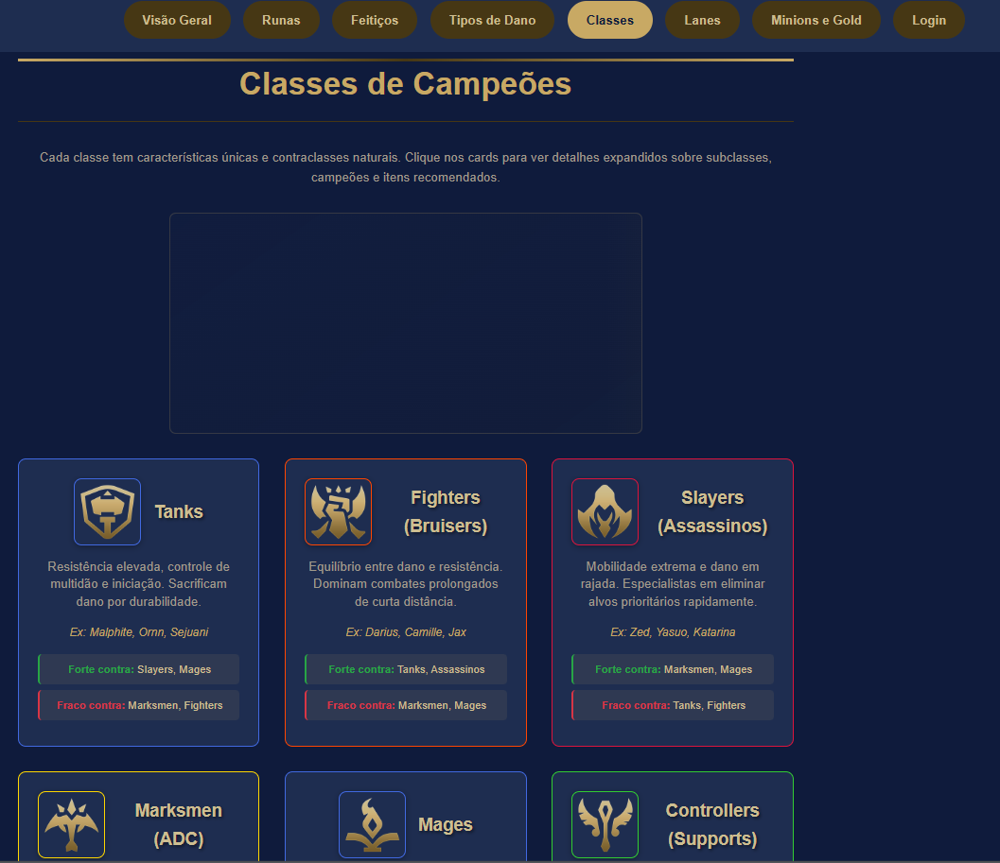

Seção educativa sobre as diferentes classes de campeões, com cards interativos e informações detalhadas sobre cada categoria de personagem.

**8. Guia de Feitiços**<br><br>
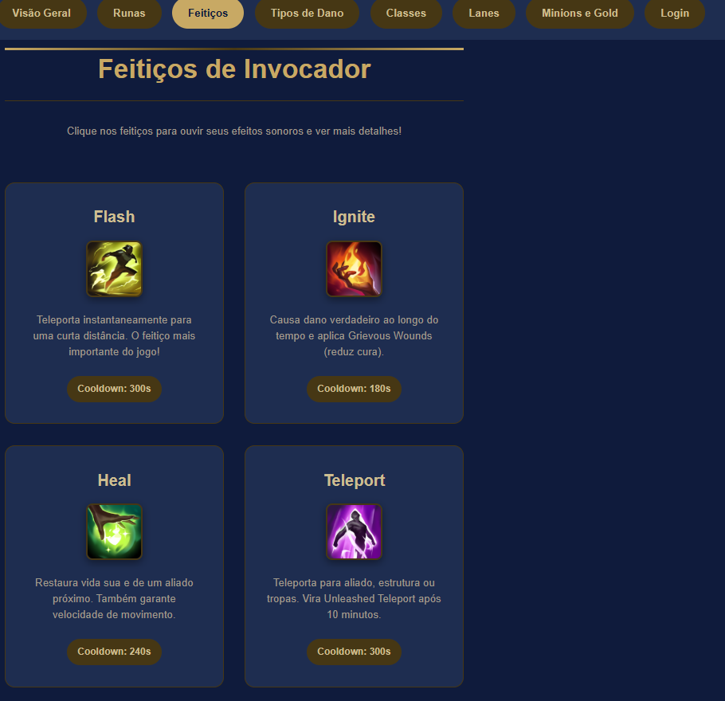

Interface educativa apresentando os feitiços do invocador, com descrições detalhadas, cooldowns e dicas de uso estratégico.

**9. Guia de Lanes**<br><br>
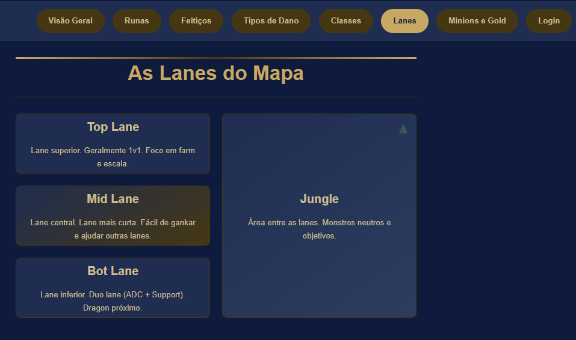

Página explicativa sobre as diferentes rotas do mapa, suas responsabilidades e características específicas de cada posição.

**10. Tipos de Dano**<br><br>
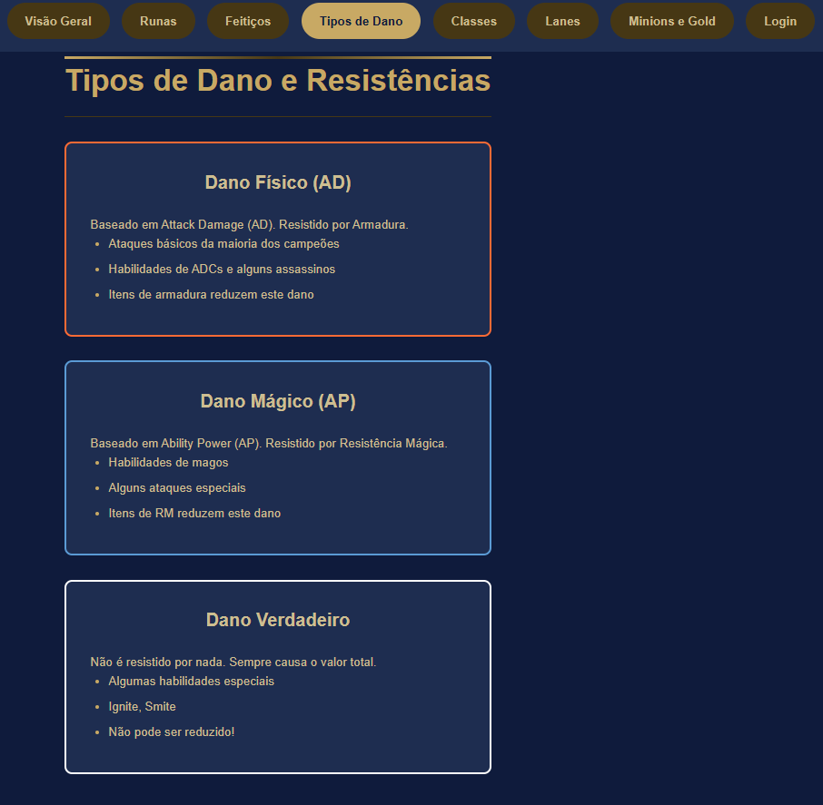

Seção educativa sobre os diferentes tipos de dano no jogo, explicando dano físico, mágico e verdadeiro com exemplos práticos.

**11. Guia de Minions**<br><br>
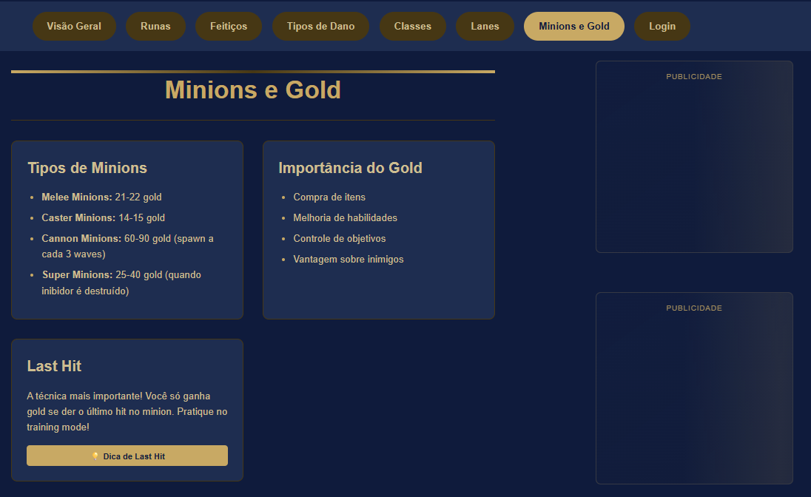

Interface educativa sobre as unidades minions, suas características, valores de ouro e estratégias de farm para novos jogadores.

---

## <a name="c4"></a>4. Desenvolvimento da Aplicação Web (Semana 8)

### 4.1 Demonstração do Sistema Web (Semana 8)

**Funcionalidades Implementadas:**

✅ **Sistema de Autenticação**
- Registro e login com validação
- Hash de senhas com bcrypt
- Sessões persistentes
- Proteção de rotas

✅ **Construtor de Páginas de Runas**
- Interface visual interativa
- Seleção de árvores primárias e secundárias
- Validação de regras do jogo
- Preview em tempo real

✅ **Gerenciamento de Runas**
- Listagem de páginas salvas
- Visualização detalhada
- Exclusão com confirmação
- Timestamps formatados

✅ **Conteúdo Educativo**
- 7 seções temáticas
- Conteúdo interativo com JavaScript
- Animações e efeitos visuais
- Design responsivo

✅ **Banco de Dados**
- PostgreSQL hospedado no Supabase
- Migrations e scripts de setup
- Operações CRUD completas

### 4.2 Conclusões e Trabalhos Futuros (Semana 8)

**Pontos Fortes:**
- ✅ Arquitetura MVC bem estruturada
- ✅ Interface intuitiva e responsiva
- ✅ Sistema de autenticação robusto
- ✅ Validações tanto frontend quanto backend
- ✅ Código bem documentado e organizado

**Pontos a Melhorar:**
- 🔄 Implementar testes unitários (Jest configurado)
- 🔄 Adicionar cache de sessões (Redis)
- 🔄 Implementar rate limiting
- 🔄 Melhorar SEO e meta tags
- 🔄 Adicionar logs estruturados

**Ideias para Melhorias Futuras:**
- 🚀 Sistema de favoritos para builds
- 🚀 Compartilhamento de páginas de runas
- 🚀 Integração com API oficial da Riot
- 🚀 Sistema de comentários e avaliações
- 🚀 Dashboard administrativo
- 🚀 Notificações push para atualizações
- 🚀 Sistema de conquistas/badges
- 🚀 Modo offline com service workers


## 5. Decisões Técnicas e Arquitetura

### 5.1 Escolha do Stack Tecnológico

#### **Backend: Node.js + Express.js**
**Decisão:** Utilização do Node.js com framework Express.js
**Justificativa:**
- **Performance**: Event-driven architecture adequada para aplicações web interativas
- **Ecosystem**: NPM oferece vasta gama de pacotes para funcionalidades específicas
- **Simplicidade**: Express.js permite desenvolvimento rápido com estrutura MVC clara
- **Conhecimento**: Familiaridade com JavaScript full-stack reduz complexidade

#### **Template Engine: EJS**
**Decisão:** EJS (Embedded JavaScript) para renderização server-side
**Justificativa:**
- **Server-side Rendering**: Melhor SEO e performance inicial comparado a SPAs
- **Integração Simples**: Sintaxe similar ao HTML com inserção de JavaScript
- **Componentização**: Partials permitem reutilização de código (header, footer)
- **Dados Dinâmicos**: Facilita passagem de dados do backend para frontend

#### **Banco de Dados: PostgreSQL + Supabase**
**Decisão:** PostgreSQL hospedado no Supabase
**Justificativa:**
- **Robustez**: PostgreSQL é enterprise-grade com ACID compliance
- **Relacionamentos**: Necessário para foreign keys entre usuários e páginas de runas
- **Supabase**: Managed service com SSL nativo e dashboard administrativo
- **Escalabilidade**: Suporte a growth futuro sem migração complexa

#### **Autenticação: Express Sessions + bcrypt**
**Decisão:** Sessions server-side com hash bcrypt
**Justificativa:**
- **Segurança**: bcrypt com salt rounds previne rainbow table attacks
- **Simplicidade**: Express-session integra nativamente com Express
- **Stateful**: Adequado para aplicação com poucos usuários simultâneos
- **Controle**: Maior controle sobre invalidação de sessões

### 5.2 Arquitetura MVC Implementada

```
ProjetoIndividualM2/
├── controllers/        # Business Logic Layer
│   ├── AuthController.js
│   ├── RunesController.js
│   └── [outros]Controller.js
├── models/            # Data Access Layer
│   ├── User.js
│   └── RunePage.js
├── views/             # Presentation Layer
│   ├── pages/
│   ├── partials/
│   └── auth/
├── routes/            # URL Routing
│   └── index.js
├── config/            # Configuration
│   └── database.js
└── public/            # Static Assets
    ├── scripts/
    ├── stylesheet/
    └── assets/
```

**Separação de Responsabilidades:**
- **Controllers**: Lógica de negócio e orchestração
- **Models**: Abstração do banco de dados e validações
- **Views**: Apresentação e UI components
- **Routes**: Mapeamento URL → Controller
- **Middleware**: Autenticação e validações transversais

---

## 6. Principais Aprendizados e Desafios Superados

### 6.1 Desafios Técnicos Críticos

#### **🧩 Complexidade do Sistema de Runas**
**Desafio:**
- League of Legends possui regras específicas para construção de páginas de runas
- Usuário deve escolher exatamente 2 runas secundárias de slots diferentes
- Preview em tempo real sincronizado com formulário

**Solução Implementada:**
```javascript
function handleSecondarySlotSelection() {
  const selectedCheckboxes = document.querySelectorAll('.secondary-slot-checkbox:checked');
  const selectedSlots = Array.from(selectedCheckboxes).map(cb => cb.dataset.slot);
  const uniqueSlots = new Set(selectedSlots);
  
  // Validação: 2 seleções de slots únicos
  if (selectedCheckboxes.length === 2 && uniqueSlots.size === 2) {
    // Desabilitar opções não selecionadas
    disableNonSelectedOptions();
  } else if (uniqueSlots.size === 1 && selectedCheckboxes.length === 2) {
    // Desmarcar última seleção se for do mesmo slot
    desmarcarUltimaSeleção();
  }
}
```

**Aprendizado:** Validações complexas no frontend requerem gerenciamento cuidadoso de estado e feedback visual claro.

#### **🔄 Sincronização Preview Tempo Real**
**Desafio:**
- Atualizar preview instantaneamente conforme usuário seleciona runas
- Manter consistência entre dados do formulário e visualização

**Solução Implementada:**
```javascript
function updateRunePreview() {
  const formData = extractFormData();
  const previewHTML = buildPreviewHTML(formData);
  document.getElementById('rune-preview-content').innerHTML = previewHTML;
}

// Attachar em todos os inputs
document.querySelectorAll('input[type="radio"], input[type="checkbox"]')
  .forEach(input => input.addEventListener('change', updateRunePreview));
```

**Aprendizado:** Event delegation e funções puras facilitam manutenção de features complexas.

#### **🔒 Segurança e Validação Dupla**
**Desafio:**
- Validar dados tanto no frontend quanto backend
- Prevenir ataques comuns (SQL injection, XSS)

**Solução Implementada:**
```javascript
// Backend - Queries parametrizadas
const result = await pool.query(
  'INSERT INTO rune_pages (user_id, name, primary_tree...) VALUES ($1, $2, $3...)',
  [userId, name, primaryTree, ...]
);

// Frontend - Sanitização e validação
const sanitizedData = {
  name: DOMPurify.sanitize(formData.name),
  // ... outras validações
};
```

**Aprendizado:** Segurança é responsabilidade de todas as camadas da aplicação.

### 6.2 Aprendizados Técnicos Significativos

#### **📊 Gerenciamento de Estado Complexo**
- **Antes:** Manipulação direta do DOM sem controle de estado
- **Depois:** Estado centralizado em objetos JavaScript com funções puras
- **Impacto:** Código mais previsível e debugging facilitado

#### **🎨 CSS Grid e Flexbox Avançado**
- **Aprendizado:** Combinação de Grid (layout macro) + Flexbox (componentes)
- **Resultado:** Interface responsiva sem media queries excessivos
- **Técnica:** Mobile-first design com progressive enhancement

#### **🚀 Performance Frontend**
- **Event Delegation:** Menos listeners, melhor performance
- **Lazy Loading:** Assets carregados conforme necessário
- **Debouncing:** Validações sem overhead excessivo

### 6.3 Metodologia de Desenvolvimento

#### **🔧 Desenvolvimento Iterativo**
1. **MVP**: Sistema básico de autenticação + CRUD runas
2. **Iteração 1**: Validações frontend + preview
3. **Iteração 2**: UI/UX polish + responsividade
4. **Iteração 3**: Conteúdo educativo + integração

#### **🧪 Testing Strategy**
- **Manual Testing**: Fluxos críticos testados em múltiplos browsers
- **Database Testing**: Scripts de verificação de integridade
- **User Acceptance**: Feedback de usuários beta (colegas de classe)

---

## 7. Avaliação de Resultados

### 7.1 Pontos que Funcionaram Muito Bem ✅

#### **🏗️ Arquitetura MVC Sólida**
- **Separação clara** de responsabilidades facilita manutenção
- **Reutilização** de componentes (partials EJS, CSS classes)
- **Escalabilidade** - fácil adicionar novas features
- **Debugging** simplificado com camadas bem definidas

#### **💎 Sistema de Runas Interativo**
- **Validação em tempo real** proporciona excelente UX
- **Preview instantâneo** elimina uncertainty do usuário
- **Feedback visual** claro para estados (selecionado, desabilitado, erro)
- **Persistência** confiável com PostgreSQL

#### **🔐 Segurança Robusta**
- **Hash bcrypt** com salt adequado
- **Sessions seguras** com HTTP-only cookies
- **Queries parametrizadas** previnem SQL injection
- **Validação dupla** (frontend + backend)

#### **🎨 Design System Consistente**
- **Paleta de cores** inspirada no universo LoL
- **Tipografia** hierárquica clara
- **Componentes** reutilizáveis e consistentes
- **Animações** suaves que melhoram percepção de performance

### 7.2 Pontos para Melhoria Futura 🔄

#### **🧪 Testing Coverage**
**Limitação Atual:**
- Testes principalmente manuais
- Ausência de testes unitários automatizados
- Sem CI/CD pipeline

**Melhorias Propostas:**
```javascript
// Exemplo de testes desejados
describe('RuneBuilder', () => {
  test('deve validar seleção de runas secundárias', () => {
    const runesData = { ... };
    const result = validateSecondaryRunes(runesData);
    expect(result.isValid).toBe(true);
  });
});
```

#### **🌐 Internacionalização**
**Visão Futura:**
- Suporte multi-idioma (i18n)
- Nomes de runas em inglês/português
- Formatação de datas por região

### 7.3 Métricas de Sucesso Alcançadas

#### **✨ Funcionalidades Core**
- [x] **100%** das funcionalidades planejadas implementadas
- [x] **Sistema de autenticação** completo e seguro
- [x] **Construtor de runas** com validações complexas
- [x] **Interface responsiva** funcionando em mobile/desktop
- [x] **Persistência de dados** confiável

#### **🎯 Qualidade Técnica**
- [x] **Arquitetura MVC** bem estruturada
- [x] **Código limpo** com separação de responsabilidades
- [x] **Segurança** implementada em múltiplas camadas
- [x] **Performance** adequada para escala atual

#### **📈 User Experience**
- [x] **Interface intuitiva** com feedback visual claro
- [x] **Validações em tempo real** sem frustração
- [x] **Loading states** apropriados
- [x] **Error handling** graceful com mensagens úteis

---

## 8. Conclusão Técnica

### 8.1 Competências Desenvolvidas

Este projeto demonstrou proficiência em:
- **Full-stack development** com JavaScript
- **Arquitetura MVC** bem estruturada
- **Database design** e operações CRUD
- **Segurança web** moderna
- **UI/UX responsivo** com CSS avançado
- **State management** complexo no frontend

### 8.2 Preparação para Próximos Projetos

**Bases Sólidas Estabelecidas:**
- Metodologia de desenvolvimento estruturada
- Padrões de código limpo e manutenível
- Mindset de segurança first
- Experiência com debugging complexo

**Áreas de Crescimento Identificadas:**
- Testing automatizado (Jest, Cypress)
- DevOps e deployment (Docker, CI/CD)
- Performance optimization avançada
- Microservices architecture

O **League of Legends Guide** representa uma evolução significativa nas habilidades de desenvolvimento web, combinando complexidade técnica com experiência de usuário excepcional.

---

## <a name="c5"></a>9. Referências

1. **Riot Games Developer Portal** - https://developer.riotgames.com/
2. **League of Legends Official Site** - https://www.leagueoflegends.com/
3. **Express.js Documentation** - https://expressjs.com/
4. **EJS Templating** - https://ejs.co/
5. **PostgreSQL Documentation** - https://www.postgresql.org/docs/
6. **Supabase Documentation** - https://supabase.com/docs
7. **MDN Web Docs** - https://developer.mozilla.org/
8. **Node.js Best Practices** - https://github.com/goldbergyoni/nodebestpractices

---